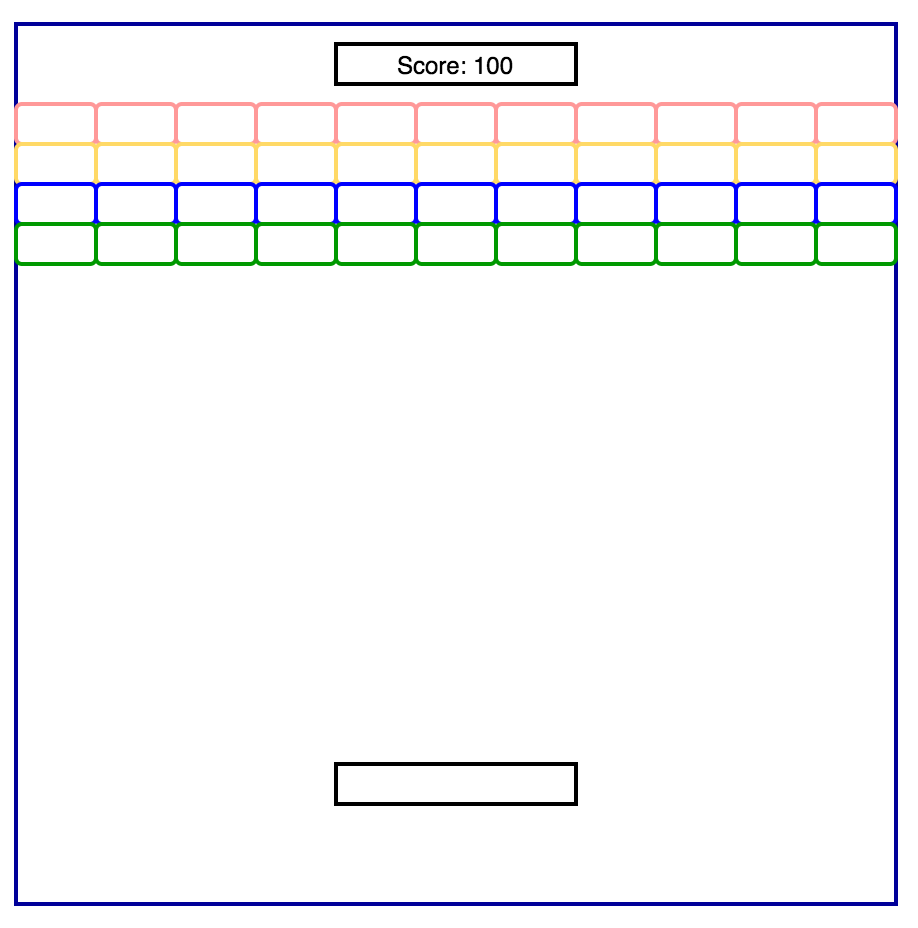

# Breakout Clone (name TBD)

### Background

Breakout Clone (name TBD) is a JavaScript game inspired by Atari's Breakout video game.
The goal of the game is to  bounce a ball on a paddle in order to break all of the bricks.

### Functionality & MVP

Playing Breakout Clone, users will be able to:

- [ ] Move the paddle and intercept the ball from falling off the screen
- [ ] Bounce the ball off of the paddle and walls
- [ ] Break bricks with the ball
- [ ] Win the game when all bricks are destroyed

### Architecture & Technologies

This project will be implemented with the following technologies:

- `JavaScript` for game logic
- `Webpack` to bundle js files.
- `HTML Canvas` to render game elements

### Wireframe

### Implementation Timeline

**Day 1**: Setup all necessary Node modules. Create canvas elements for paddle, ball, bricks,
and game board.

**Day 2**: Write game logic including ball trajectory and bricks being destroyed.

**Day 3**: Install the controls for the user to interact with the game.  
Style the frontend to evoke the feel of Atari's Breakout.
